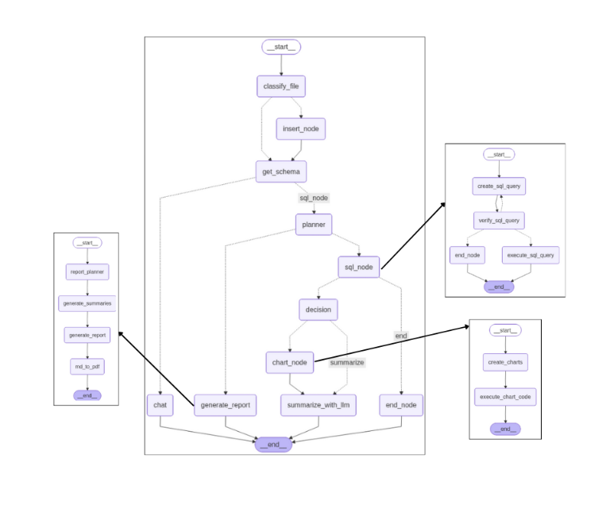
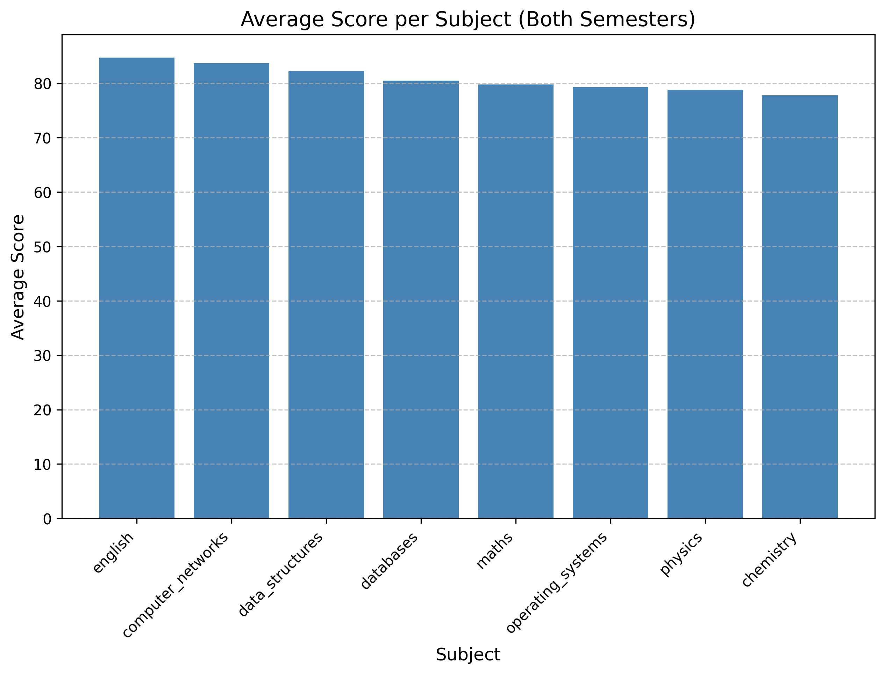

# AnalyticsAI

AnalyticsAI is a LangGraph-based multi-agent analytics system that transforms structured data (CSV files, Excel files, SQL databases, or images containing tables) into executable analytics workflows using natural language.

The system converts user questions into verified SQL queries, executes analytics safely, generates visualizations, produces natural-language summaries, and creates structured reports. It supports conversational interaction, secure authentication, and modular execution pipelines.

---

## Overview

AnalyticsAI enables users to interact with structured datasets without writing SQL manually. It automatically:

* Understands user intent from natural language
* Generates SQL queries
* Verifies queries for safety and correctness
* Executes analytics workflows
* Produces charts
* Generates summaries
* Creates structured Markdown and optional PDF reports
* Supports conversational follow-up queries

The system is designed with safety, modularity, and production-readiness in mind.

---

## Key Features

### Multi-Source Data Support

* CSV files
* Excel files
* Existing SQL databases (SQLite by default, PostgreSQL supported)
* Images containing structured or handwritten tables

### Secure Authentication

* Google OAuth 2.0 login
* JWT-based session management
* Token blacklisting support

### Natural Language to SQL

* Converts plain English questions into SQL
* Multi-step SQL verification:

  * Manual table validation
  * Manual column validation
  * LLM-based syntax validation
  * LLM-based intent alignment validation
* Limited reflection retries (maximum two correction cycles)

### Automated Visualization

* Automatic chart generation (bar, line, pie, etc.)
* Dynamic chart specification creation
* Image export of visualizations

### LLM-Powered Summaries

* Converts raw query results into concise, human-readable insights
* Designed for executive-level explanations

### Report Generation

* Structured Markdown reports
* Section-based planning
* Optional PDF export

### Conversational Workflow

* Follow-up questions supported at any stage
* Shared graph memory
* Iterative refinement

### Automatic Schema Discovery

* Extracts:

  * Tables
  * Columns
  * Data types
  * Foreign key relationships
* Preprocesses schema for downstream agents

---

# Architecture Overview

The system follows a structured multi-agent workflow:

1. Input Classification
2. Data Ingestion
3. Schema Extraction
4. Planning Agent
5. SQL Subgraph
6. Decision Routing
7. Chart Subgraph
8. Summarization
9. Report Generation Subgraph
10. Chat Interface

---

# High-Level Workflow



### 1. Input Understanding

Determines whether the input is a file, database, image, or direct query.

### 2. Data Ingestion

Loads CSV or Excel files into SQLite (default). PostgreSQL is supported as an alternative backend.

### 3. Schema Discovery

Extracts complete schema metadata including tables, columns, data types, and relationships.

Example:

```
TABLE: sem1_marks
  - roll_no (character varying)
  - student_name (character varying)
  - maths (integer)
  - physics (integer)
  - chemistry (integer)
  - english (integer)

TABLE: sem2_marks
  - roll_no (character varying)
  - student_name (character varying)
  - data_structures (integer)
  - databases (integer)
  - operating_systems (integer)
  - computer_networks (integer)
```

This schema is passed to the planner and SQL agent.

### 4. Planning Agent

The planner converts user intent into a structured execution plan. Example:

```json
{
  "create_sql_query": "...",
  "verify_sql_query": "...",
  "execute_sql_query": "...",
  "create_charts": "...",
  "execute_chart_code": "...",
  "summarize_with_llm": "..."
}
```

The planner determines the correct sequence of tools and ensures safe execution.

---

# SQL Agent (Subgraph)

The SQL agent is responsible for safe and correct query generation and execution.

Flow:

1. create_sql_query
2. verify_sql_query
3. execute_sql_query

Example query (unpivoting semester marks):

```sql
SELECT
    s.roll_no,
    s.student_name,
    v.subject,
    v.mark
FROM
    sem1_marks AS s
CROSS JOIN LATERAL
    (VALUES
        ('maths',      s.maths),
        ('physics',    s.physics),
        ('chemistry',  s.chemistry),
        ('english',    s.english)
    ) AS v(subject, mark);
```

Verification includes:

* Table name checks (manual)
* Column name checks (manual)
* Intent alignment checks (LLM)
* Syntax validation (LLM)
* Maximum two correction cycles

This separation prevents hallucinated or unsafe SQL execution.

---

# Chart Agent (Subgraph)

Responsible for:

* Generating chart specifications
* Producing Python plotting code
* Executing chart generation
* Saving image files

Nodes:

* create_charts
* execute_chart_code

Example chart output:



---

# Summarization Agent

The summarization agent converts structured outputs into human-readable insights, highlighting trends, distributions, and key metrics.

---

# Report Generation Agent (Subgraph)

Pipeline:

1. report_planner
2. generate_summaries
3. generate_report
4. md_to_pdf

Outputs:

* Structured Markdown report
* Optional PDF version

Example:

[Report Example](report.md)

---

# Chat Node

The chat node enables conversational interaction with shared graph memory and can be invoked at any stage in the workflow.

---

# Project Structure

```
analytics-ai/
├── README.md
├── auth-backend
│   └── app
│       ├── auth/
│       ├── config.py
│       ├── database.py
│       ├── main.py
│       ├── models.py
│       ├── router.py
│       ├── schemas.py
│       └── service.py
├── backend
│   ├── app
│   │   ├── assets/
│   │   ├── auth/
│   │   ├── core/
│   │   ├── graphs/
│   │   ├── helper/
│   │   ├── nodes/
│   │   ├── routers/
│   │   ├── services/
│   │   ├── utils/
│   │   └── main.py
│   ├── saved_graphs/
│   ├── static/
│   └── uploads/
├── frontend
│   ├── src/
│   │   ├── components/
│   │   ├── context/
│   │   ├── services/
│   │   └── store/
│   └── vite.config.js
├── requirements.txt
└── workflow.png
```

---

# Getting Started

## Prerequisites

* Python 3.10 or higher
* Node.js 18 or higher
* SQLite (default)
* PostgreSQL (optional)
* Google OAuth 2.0 credentials

---

## Installation

Clone the repository:

```bash
git clone https://github.com/yourusername/analytics-ai.git
cd analytics-ai
```

Install backend dependencies:

```bash
cd backend
pip install -r requirements.txt
```

Install authentication backend dependencies:

```bash
cd ../auth-backend
pip install -r requirements.txt
```

Install frontend dependencies:

```bash
cd ../frontend
npm install
```

---

## Running the System

Start services in separate terminals.

Main backend (port 8000):

```bash
cd backend
uvicorn app.main:app --port 8000 --reload
```

Authentication backend (port 8001):

```bash
cd ../auth-backend
uvicorn app.main:app --host 0.0.0.0 --port 8001 --reload
```

Frontend:

```bash
cd ../frontend
npm run dev
```

The frontend is typically available at:

```
http://localhost:5173
```

Log in using Google OAuth, upload a file or image, and begin querying in natural language.

---

# Authentication Flow

1. User selects Google login
2. Redirect to Google OAuth consent screen
3. Callback handled by authentication backend
4. JWT issued
5. Token stored in frontend
6. Protected routes become accessible

---

# Safety and Reliability Design

* Structured multi-agent graph architecture
* SQL verification before execution
* Limited reflection cycles
* Result caching
* Modular subgraphs
* Secure JWT-based authentication

---

# Technology Stack

Backend:

* FastAPI
* LangGraph
* LLM integration
* SQLite / PostgreSQL
* Matplotlib (for charts)

Authentication Backend:

* FastAPI
* Google OAuth 2.0
* JWT

Frontend:

* React (Vite)
* Context API
* Modular component architecture

---

# Summary

AnalyticsAI is a modular, secure, and production-oriented multi-agent analytics system that:

* Converts natural language into verified SQL
* Executes analytics safely
* Generates visualizations automatically
* Produces executive-level summaries
* Builds structured reports
* Supports conversational analytics workflows
